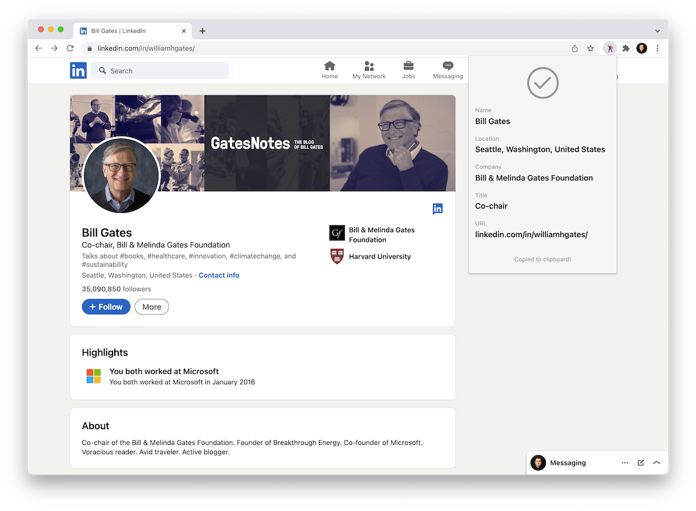

# LinkedIn Profiler

A simple Chrome extension to retrieve key data from a LinkedIn profile and copy it to clipboard. Extracts person name, location, company name, current title, and URL from the current profile. Information is tab-separated and added to the clipboard to be pasted into a spreadsheet for lead generation.

## Setup

1. [Download](https://siebenrock.github.io/linkedin-profiler/Profiler.zip) the <kbd>.zip</kbd> file and extract content
2. Open extension page in Google Chrome: type *chrome://extensions* in URL bar
3. Activate developer mode: Turn on switch on top right
4. Load extension: Click "Load unpacked" and select folder that contains <kbd>manifest.json</kbd> file

## Use

- Press <kbd>Cmd</kbd> <kbd>Shift</kbd> <kbd>S</kbd> on any LinkedIn profile to copy data
  - On Windows <kbd>Ctrl</kbd> <kbd>Shift</kbd> <kbd>S</kbd>

## Remarks

- Set the LinkedIn language to English
